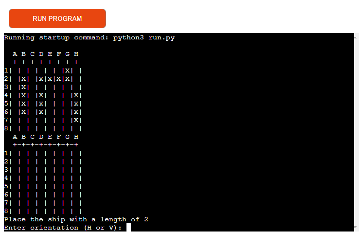

# A Battleships Game
Portfolio Project 3 Python Essentials - Code Institute

[View Live Website Here](https://my-battleship-game.herokuapp.com/)

# About
This game is of [battleships](http://battleship-game.net/), a well known game originally made on paper after WWI. This version differs from many others in that it is for one user against the computer with randomly generated battleship locations of one square. This game was made in haste and following a tutorial due to the creator having a time constraints because of the projects deadline and because of personal issues. It was made to showcase that the creator understand how to build a simple battleship game and to showcase a passable degree of knowledge for it. It was not intended to reach for a higher grade but only in the hope of achieving a passing grade so that the creator could take a well earned break from work / CI due to being put under (creators own chosen) stress.

# How To Play
The game will start by asking the user to place its ships on the board, and then the game will start. The user is the first one to start playing.
## Breakdown on starting procedure
The game will then request that the user enters a column and row number (essentially, co-ordinates) of the location they suspect a battleship is laid. If that location is on a battleship, it is a hit and marked as "#". If the location is not on a battleship, it is a miss and marked as "*". 
The computer and user will take ten turns to find all 4 of the ships, should all 10 turns be taken without finding 4 ships, the game will state who has had the most hits and display them as the winner. 

## Table of Contents
[User Experience (UX)](#ux)

[Features](#features)

[Debugging](#debugging)

[Technologies Used](#technologies)

[Deployment](#deployment)

[Credits](#credits)

## User Experience (UX)

### User Stories
#### As a player
    1. I want to easily be able to see what coordinates I have and have not hit.
    1. I don't wan't large amounts of text to distract from the game itself.

### Design
    - The rows and columns are numbered and lettered respectively.

### Existing Features
- [x] **Clearly Labeled Axes** - Makes for a smooth user exerience.
- [x] **Clearly Labeled Axes** - The game accepts user input for co-ordinates they wish to fire at
- [x] **Clearly Labeled Axes** - The game is played against the computer

### Future Features
- [ ] Use the username throughout the game rather than just in the welcoming statement so that the user can be more personally celebrated or commiserated at the end of the game.
- [ ] The game keeps count of turns and displays this to the user
- [ ] Allow the user to choose to play against a other (local) player or the computer
- [ ] Allow the user to dictate the number of ships and the board size

## Debugging

- When i ran into this error message in the console.
```
- [Running] python -u "c:\Users\jambr\OneDrive\Dokument\GitHub\my-python-game\run.py"
- Traceback (most recent call last):
- File "c:\Users\jambr\OneDrive\Dokument\GitHub\my-python-game\run.py", line 168, in <module>
- place_ships(COMPUTER_BOARD)
- File "c:\Users\jambr\OneDrive\Dokument\GitHub\my-python-game\run.py", line 36, in place_ships
- orientation, row, column = random.choice(["H", "V"]), random.randint(0,7), random.randint(0,7)
- NameError: name 'random' is not defined
```
- I had to retrace my steps and find the faulty lines and then correct it

## Technologies Used
- [Heroku](https://www.heroku.com/) - Heroku is used to deploy the application.
- [Github](https://github.com/) - GitHub is used to host the project files.

### Languages Used

- [Python](https://www.python.org/)
- [Git](https://git-scm.com/) - Git was used for version control.

## Deployment
This project was deployed using Code Institute's mock terminal for Heroku.

The steps for deployment are as follows:
- Fork or clone this repository
- Create a new Heroku app
- Set the buildpacks to Python and NodeJS in that order
- Link the Heroku app to the repository
- Click on Deploy

### Build Log From Heroku
```
-----> Building on the Heroku-22 stack
-----> Using buildpacks:
       1. heroku/python
       2. heroku/nodejs
-----> Python app detected
-----> No Python version was specified. Using the same version as the last build: python-3.10.9
       To use a different version, see: https://devcenter.heroku.com/articles/python-runtimes
-----> No change in requirements detected, installing from cache
-----> Using cached install of python-3.10.9
-----> Installing pip 22.3.1, setuptools 63.4.3 and wheel 0.37.1
-----> Installing SQLite3
-----> Installing requirements with pip
-----> Node.js app detected
       
-----> Creating runtime environment
       
       NPM_CONFIG_LOGLEVEL=error
       NODE_VERBOSE=false
       NODE_ENV=production
       NODE_MODULES_CACHE=true
       
-----> Installing binaries
       engines.node (package.json):  unspecified
       engines.npm (package.json):   unspecified (use default)
       
       Resolving node version 18.x...
       Downloading and installing node 18.12.1...
       Using default npm version: 8.19.2
       
-----> Restoring cache
       - node_modules
       
-----> Installing dependencies
       Installing node modules (package.json)
       
       up to date, audited 10 packages in 777ms
       
       3 vulnerabilities (2 moderate, 1 critical)
       
       To address issues that do not require attention, run:
         npm audit fix
       
       Some issues need review, and may require choosing
       a different dependency.
       
       Run `npm audit` for details.
       
-----> Build
       
-----> Caching build
       - node_modules
       
-----> Pruning devDependencies
       
       up to date, audited 10 packages in 353ms
       
       3 vulnerabilities (2 moderate, 1 critical)
       
       To address issues that do not require attention, run:
         npm audit fix
       
       Some issues need review, and may require choosing
       a different dependency.
       
       Run `npm audit` for details.
       
-----> Build succeeded!
-----> Discovering process types
       Procfile declares types -> web
-----> Compressing...
       Done: 62.5M
-----> Launching...
       Released v14
       https://my-battleship-game.herokuapp.com/ deployed to Heroku
```

## Credits

### Content

- I based this project off of a YouTube tutorial (https://www.youtube.com/watch?v=xz9GrOwQ_5E&t=0s) but then expanded on it to fit the brief criteria.
- I relied on my course notes and Stack Overflow when I ran into problems as well.
- I also relied on my extra course over at UDEMY (https://www.udemy.com/course/100-days-of-code/learn/lecture/19141104?start=30#overview) to help me understand but also to build this battleship game.
  ### Acknowledgments
- Thanks to my mentor, Maranatha Ilesanmi.
- Thanks to the team at Code Institute.